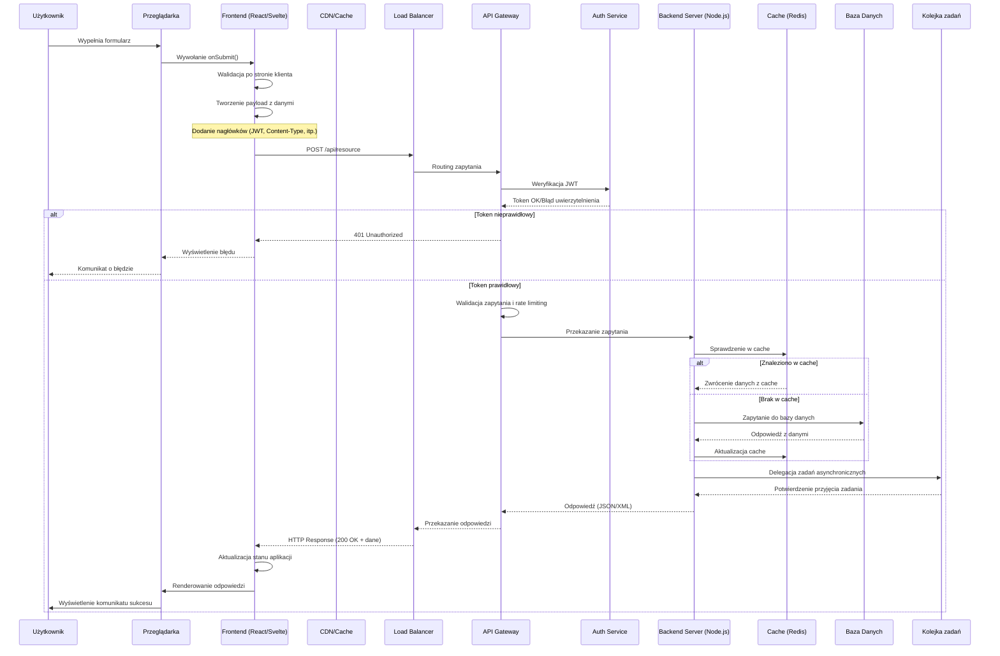

```mermaid
sequenceDiagram
    participant Użytkownik
    participant Przeglądarka
    participant Frontend as Frontend (React/Svelte)
    participant CDN as CDN/Cache
    participant LoadBalancer as Load Balancer
    participant API as API Gateway
    participant Auth as Auth Service
    participant Serwer as Backend Server (Node.js)
    participant Cache as Cache (Redis)
    participant DB as Baza Danych
    participant Queue as Kolejka zadań

    Użytkownik->>Przeglądarka: Wypełnia formularz
    Przeglądarka->>Frontend: Wywołanie onSubmit()
    Frontend->>Frontend: Walidacja po stronie klienta
    Frontend->>Frontend: Tworzenie payload z danymi

    Note over Frontend: Dodanie nagłówków (JWT, Content-Type, itp.)

    Frontend->>LoadBalancer: POST /api/resource
    LoadBalancer->>API: Routing zapytania

    API->>Auth: Weryfikacja JWT
    Auth-->>API: Token OK/Błąd uwierzytelnienia

    alt Token nieprawidłowy
        API-->>Frontend: 401 Unauthorized
        Frontend-->>Przeglądarka: Wyświetlenie błędu
        Przeglądarka-->>Użytkownik: Komunikat o błędzie
    else Token prawidłowy
        API->>API: Walidacja zapytania i rate limiting
        API->>Serwer: Przekazanie zapytania

        Serwer->>Cache: Sprawdzenie w cache

        alt Znaleziono w cache
            Cache-->>Serwer: Zwrócenie danych z cache
        else Brak w cache
            Serwer->>DB: Zapytanie do bazy danych
            DB-->>Serwer: Odpowiedź z danymi
            Serwer->>Cache: Aktualizacja cache
        end

        Serwer->>Queue: Delegacja zadań asynchronicznych
        Queue-->>Serwer: Potwierdzenie przyjęcia zadania

        Serwer-->>API: Odpowiedź (JSON/XML)
        API-->>LoadBalancer: Przekazanie odpowiedzi
        LoadBalancer-->>Frontend: HTTP Response (200 OK + dane)

        Frontend->>Frontend: Aktualizacja stanu aplikacji
        Frontend->>Przeglądarka: Renderowanie odpowiedzi
        Przeglądarka->>Użytkownik: Wyświetlenie komunikatu sukcesu
    end
```
